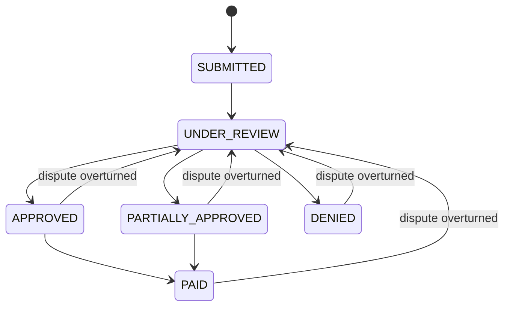
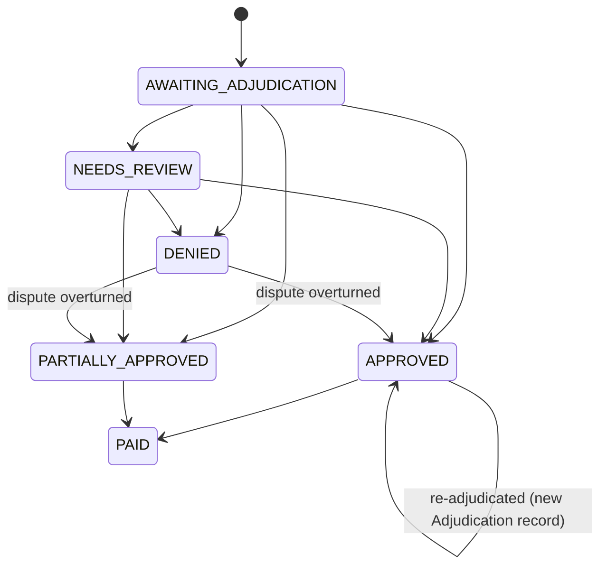
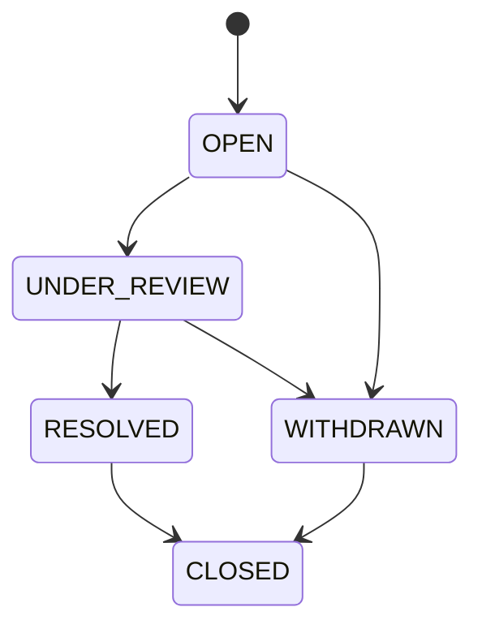

# Domain Model — Claims Processing System

> Implementation-ready domain model for an insurance claims adjudication system.
> This document is the foundation for coding, testing, and design discussions.

---

## 1. Mental Model

Claims processing is **not "approve or deny."** It is a line-by-line adjudication that answers four
questions for every billed service:

1. **Is it covered?** (eligibility, coverage, exclusion)
2. **How much is payable?** (limits → deductible → cost share)
3. **Why this decision?** (explanation + calculation trace)
4. **What state is it in now?** (line state, rolled up to claim state)

The clean separation that makes the system explainable and auditable:

| Concept | Says... | Lives in |
|---|---|---|
| **Policy** | what is promised, for what period | `Policy` |
| **CoverageRule** | how to evaluate a promise (limits, cost share) | `CoverageRule` |
| **Claim / ClaimLine** | what the member asked for | `Claim`, `ClaimLine` |
| **Adjudication** | the decision + the math + the "why" | `Adjudication` (on line) |
| **UsageLedger** | what part of limits/deductibles is already consumed | `UsageLedger` |

**Key principle:** *usage is never stored inside a rule.* The rule says "covered up to $4,000/year";
the ledger says "this member has already used $3,500 this year." Keeping these apart is what lets the
system explain decisions and reverse them cleanly on dispute.

**Adjudication is a fixed pipeline, not a rule engine.** Coverage rules are *configuration data*
(authored as JSON, deserialized into validated typed structs); the *logic* lives in dedicated pipeline
functions run in a fixed order encoded in code. Configurable parameters are not a DSL — the red line is
that JSON carries only values, never expressions/conditions/formulas. No interpreter, no workflow engine.

**Claim is derived; ClaimLine is authoritative.** A `ClaimLine` is one billable service and the only
place adjudication and payable math happen — its state is *written* by the pipeline. A `Claim` is the
envelope (member, policy, provider, date of service); it carries no decision of its own — its state and
totals are a *pure function* of its lines (plus a derived dispute status). **Claim state is never set
directly.**

---

## 2. Domain Model

### 2.1 Core Entities

| Entity | Purpose | Key Attributes | Why it exists |
|---|---|---|---|
| **Member** | Covered person; accumulator owner | `member_id`, `name` (PHI), `dob` | Limits/deductibles accumulate per member |
| **Policy** | Contract: promises + period + deductible | `policy_id`, `member_id`, `effective_date`, `termination_date`, `plan_year`, `annual_deductible` | Eligibility = policy active on date of service |
| **CoverageRule** | One coverage promise for a service category (authored as JSON, validated into a typed struct) | `service_category` *(natural key — one promise per category)*, `covered`, `annual_limit?`, `visit_limit?`, `per_incident_max?`, `coinsurance_rate`, `copay?`, `review_threshold?` | The promise; carries policy terms as data, never consumed usage. Values only — no expressions, no surrogate rule id, no control flags, **and no explanation metadata** (a present `review_threshold` *is* the "pend above this amount" term; reason codes are emitted by pipeline steps, see §4/§8) |
| **Claim** | Member's submitted request (header) | `claim_id`, `member_id`, `policy_id`, `provider`, `date_of_service`, `submitted_at`, `state` *(derived — see §6)* | The unit members submit/track; state is **derived** from lines |
| **ClaimLine** | One billed service; atomic adjudication unit | `line_id`, `claim_id`, `service_code`, `service_category`, `diagnosis_code` (PHI), `billed_amount`, `units`, `state`, `current_adjudication` | Enables "3 covered, 1 denied, 1 review" |
| **Adjudication** | Decision + math + reason codes for a line, **one record per (re-)adjudication** (append-only; latest is current) | `line_id`, `sequence`, `is_current`, `decision_code` (1), `reason_codes[]` (1..n), `allowed_amount`, `deductible_applied`, `coinsurance_amount`, `copay_amount`, `payable_amount`, `member_responsibility`, `adjudicated_at` | Keeps "why" + "how much" together **and preserves decision history across disputes** for audit. The member-facing `Explanation` is *derived* from `reason_codes` + catalog, not stored |
| **UsageLedger** | Append-only record of consumed limits/deductibles | `entry_id`, `member_id`, `policy_id`, `period`, `bucket`, `amount_or_count`, `source_line_id`, `created_at` | Immutable, explainable, reversible (compensating entries) |
| **Dispute** | Member's challenge + resolution | `dispute_id`, `claim_id`, `line_ids[]`, `reason`, `state`, `resolution_outcome`, `resolution_note`, `opened_at`, `resolved_at` | Preserves original + dispute decisions for audit |
| **ExplanationCode** | Reference catalog: code → templates | `code`, `short_message`, `detail_template`, `category` | Consistent, reusable reason text |

### 2.2 Value Objects

- **Money** — amount in integer minor units + currency. Never floats.
- **ServiceCode** — coded service identifier (CPT-like string).
- **CostShare** — `coinsurance_rate` + `copay`.
- **CalculationBreakdown** — ordered line of the payable math.
- **Explanation** — resolved `ExplanationCode` + filled messages + breakdown.
- **Period** — plan year used to scope accumulators.

### 2.3 Removed / Simplified / New (vs. initial research)

| Action | Entity | Reason |
|---|---|---|
| **Removed** | `CoveragePlan` | Merged into `Policy`; no multi-plan need in scope |
| **Removed** | `BenefitLimit` | Limits are `CoverageRule` attributes |
| **Removed** | `DeductibleAccumulator` | Merged into `UsageLedger` |
| **Removed** | `DiagnosisCode` / `ProcedureCode` / `ServiceType` as entities | Become coded value objects on the line |
| **Simplified** | `AdjudicationDecision` → append-only `Adjudication` list | Flat immutable records (latest = current), not a versioned aggregate with its own lifecycle |
| **Simplified** | `UsageLedgerEntry` → `UsageLedger` | One ledger for both deductible & limit consumption |
| **New** | `Dispute` | Required by domain, missing from research |
| **New** | `Money`, `CostShare` value objects | Correctness of money math + explicit cost share |

---

## 3. ER Diagram

```mermaid
erDiagram
    MEMBER ||--o{ POLICY : holds
    MEMBER ||--o{ USAGE_LEDGER : accumulates
    POLICY ||--o{ COVERAGE_RULE : defines
    POLICY ||--o{ CLAIM : "is basis for"
    MEMBER ||--o{ CLAIM : submits
    CLAIM ||--|{ CLAIM_LINE : contains
    CLAIM_LINE ||--o{ ADJUDICATION : "has history (1 current)"
    CLAIM_LINE ||--o{ USAGE_LEDGER : "produces (on approve)"
    COVERAGE_RULE ||--o{ ADJUDICATION : "applied by"
    CLAIM ||--o{ DISPUTE : "may raise"
    DISPUTE }o--o{ CLAIM_LINE : targets
    EXPLANATION_CODE ||--o{ ADJUDICATION : "referenced by"

    MEMBER { string member_id PK; string name; date dob }
    POLICY { string policy_id PK; string member_id FK; date effective_date; date termination_date; int plan_year; int annual_deductible_minor }
    COVERAGE_RULE { string policy_id FK; string service_category PK; bool covered; int annual_limit_minor; int visit_limit; int per_incident_max_minor; decimal coinsurance_rate; int copay_minor; int review_threshold_minor }
    CLAIM { string claim_id PK; string member_id FK; string policy_id FK; string provider; date date_of_service; datetime submitted_at; string state "derived; cache only" }
    CLAIM_LINE { string line_id PK; string claim_id FK; string service_code; string service_category; string diagnosis_code "PHI"; int billed_minor; int units; string state }
    ADJUDICATION { string adjudication_id PK; string line_id FK; int sequence; bool is_current; string decision_code; string reason_codes; int allowed_minor; int deductible_applied_minor; int coinsurance_minor; int copay_minor; int payable_minor; int member_resp_minor; datetime adjudicated_at }
    USAGE_LEDGER { string entry_id PK; string member_id FK; string policy_id FK; int period; string bucket; int amount_or_count; string source_line_id; datetime created_at }
    DISPUTE { string dispute_id PK; string claim_id FK; string reason; string state; string resolution_outcome; string resolution_note; datetime opened_at; datetime resolved_at }
    EXPLANATION_CODE { string code PK; string short_message; string detail_template; string category }
```

### Relationships

| Relationship | Cardinality | Ownership | Business rationale |
|---|---|---|---|
| Member → Policy | 1‑to‑many | Member owns | Policies held over time; eligibility picks the one active on DOS |
| Policy → CoverageRule | 1‑to‑many | Policy owns (cascade) | Rules have no meaning outside their policy |
| Claim → ClaimLine | 1‑to‑many (≥1) | Claim owns (cascade) | A claim with no lines can't be adjudicated |
| ClaimLine → Adjudication | 1‑to‑many (append-only; one `is_current`) | Line owns | Each (re-)adjudication appends a record; history preserved across disputes |
| ExplanationCode → Adjudication | 1‑to‑many (via `reason_codes`) | Catalog referenced | Each reason code resolves to catalog text |
| ClaimLine → UsageLedger | 1‑to‑many | Ledger references line | Approval consumes limits/deductible |
| Member → UsageLedger | 1‑to‑many | Member owns | Accumulators are per member per period |
| Claim → Dispute | 1‑to‑many | Claim owns | Disputes are filed against a claim |
| Dispute ↔ ClaimLine | many‑to‑many | join | A dispute may contest specific lines |

**Denormalization intentionally deferred:** claim `total_payable` and per-period accumulator *balances*
could be cached for read speed. Avoided now — the `UsageLedger` is the source of truth and caching
introduces invalidation bugs on dispute reversals. Compute balances by summing the ledger; add a
materialized balance later only when volume justifies it.

---

## 4. Coverage Rule Design

A `CoverageRule` **has no behavior** — every field is a value. So rules are **authored as JSON
configuration** and deserialized into a **validated typed struct** at load time; the *logic* lives in
dedicated pipeline functions run in a **fixed order** encoded in code. This gives configurability
(analysts edit limits/rates/categories without a recompile, fixtures are declarative) without a DSL.

**The red line — configuration vs DSL:** JSON may carry only *parameters whose meaning is fixed by
code* (`annual_limit`, `coinsurance_rate`, `covered`, `service_category`…). The moment a `condition`,
`expression`, `formula`, or `operator` field appears, it has become a DSL requiring an interpreter —
**reject it in code review.** A strict loader must fail fast on unknown fields and bad types/ranges.
(Coverage rules carry **no** explanation metadata — reason codes are emitted by pipeline steps and
resolved against the catalog; the catalog's completeness is checked once at startup, not per rule.)

```jsonc
// policies/standard-plan-2026.json — validated into typed CoverageRule structs at load
{
  "policy_id": "POL-001",
  "plan_year": 2026,
  "annual_deductible": 50000,          // integer minor units = $500.00
  "exclusions": ["EXPERIMENTAL"],      // policy-level carve-outs (denied even if the category is covered)
  "coverage": [
    {
      "service_category": "PHYSICAL_THERAPY",   // natural key — exactly one promise per category
      "covered": true,
      "annual_limit": 400000,          // $4,000
      "coinsurance_rate": 0.20,
      "copay": 2500,                   // $25
      "review_threshold": null         // present + billed above it ⇒ pend for review; absent ⇒ never pends
    },
    { "service_category": "COSMETIC", "covered": false }
  ]
}
```

Each rule type is evaluated by a dedicated function in a **fixed pipeline order** — ordering is in code
and identical for every claim, never a `priority` field in the data.

| Rule | Purpose | Inputs | Output | Example |
|---|---|---|---|---|
| **Eligibility** | Policy active on DOS? | policy dates, DOS | pass / **hard-deny** | DOS 2026‑06‑01, policy termed 2026‑05‑31 → `POLICY_INACTIVE` |
| **Coverage** | Category covered? | service_category, `covered` | pass / **hard-deny** | `COSMETIC`, covered=false → `NOT_COVERED` |
| **Exclusion** | Explicitly excluded? | category, exclusion list | pass / **hard-deny** | `EXPERIMENTAL` → `EXCLUDED_SERVICE` |
| **Review** | Needs a human? | billed, `review_threshold` | pass / **pend** | `review_threshold` set and billed > $10,000 → `PENDED_FOR_REVIEW` |
| **Limit** | Remaining annual/visit/incident? | rule limits, ledger balance | `allowed` cap | PT limit $4,000, used $3,500 → cap $500 → `ANNUAL_LIMIT_APPLIED` |
| **Deductible** | Apply remaining deductible | `annual_deductible`, ledger | reduces payable | $300 left → first $300 is member's |
| **Cost share** | Copay + coinsurance | `copay`, `coinsurance_rate` | reduces payable | 20% coinsurance → plan pays 80% post-deductible |

**Why this approach:** JSON gives plan analysts safe configurability; the typed struct + fixed pipeline
keeps the logic trivially unit-testable (one test per rule + ordering tests), reading like the policy
document a human would read, with no interpreter to debug. A generic engine would push business logic
into data and make "why was this denied?" require simulating an evaluator — the opposite of explainable.

---

## 5. Adjudication Flow

### Claim submission flow
1. Validate: ≥1 line, all amounts ≥ 0, DOS present.
2. Reject duplicate lines (same `service_code` + `billed_amount` + `units`).
3. Claim → `SUBMITTED`.

### Per-claim adjudication
1. Claim → `UNDER_REVIEW`. Load policy + rules + current ledger balances.
2. Adjudicate **each line** through the pipeline (below).
3. Derive claim state from line states (§6).
4. On payment: approved/partial lines → `PAID`, claim → `PAID`.

### Per-line evaluation (pipeline order)
```
a. Eligibility   → hard-deny on fail
b. Coverage      → hard-deny if not covered
c. Exclusion     → hard-deny if excluded
d. Review        → pend (stop here, no payment yet)
e. allowed = min(billed, per_incident_max?)
   Limit         → allowed = min(allowed, remaining_limit)
f. Deductible    → deductible_applied = min(allowed, remaining_deductible)
                   after_ded = allowed - deductible_applied
g. Cost share    → coinsurance = after_ded * coinsurance_rate
                   payable = after_ded - coinsurance - copay
h. member_responsibility = billed - payable
i. Set line state: APPROVED | PARTIALLY_APPROVED | DENIED | NEEDS_REVIEW
j. On approve/partial: write UsageLedger entries (deductible + limit/visit consumed)
k. Generate explanation from driving rule + calculation breakdown
```

### Usage tracking
Ledger writes happen **only on approval**, keyed to `source_line_id`. A dispute overturn posts a
**compensating entry** rather than editing history.

---

## 6. State Machines

**`DISPUTED` is NOT a stored claim or line state.** Dispute status lives in the `Dispute` entity (its
own machine, below). "Is this claim disputed?" is **derived** = the claim has a `Dispute` in
`{OPEN, UNDER_REVIEW}`. This avoids the ambiguity of a PAID claim that also reads `DISPUTED`, and the
bugs of "what state do we restore after resolution." On overturn the claim simply re-enters
`UNDER_REVIEW` for re-adjudication. (The problem statement's "disputed" business state is satisfied as a
*derived display status*, not a mutually-exclusive stored state.)

### Claim

- **Valid:** submit → review → outcome → paid; an open dispute that overturns sends the claim back to `UNDER_REVIEW`.
- **Invalid:** SUBMITTED → PAID (must adjudicate); DENIED → PAID (nothing payable); editing a PAID claim's lines without a Dispute.
- `CLOSED` is intentionally omitted — `PAID` and `DENIED` are terminal enough for this scope (see §9 nice-to-have).

### Claim Line
States: `AWAITING_ADJUDICATION` (not yet decided) and `NEEDS_REVIEW` (decided to pend for a human) —
deliberately *not* the near-identical `PENDING`/`PENDED` pair.

- **Invalid:** AWAITING_ADJUDICATION → PAID; DENIED → PAID. Internal pipeline steps (eligibility-checked, etc.) are **not** persisted states. Re-adjudication appends a new `Adjudication` record rather than introducing a `DISPUTED` line state.

### Claim state derivation (pure function of line states)
Evaluated as ordered guard clauses — first match wins, so the set is **exhaustive** (every line-state
combination maps to exactly one claim state):
```
1. any line NEEDS_REVIEW                       → UNDER_REVIEW   (not finished)
2. else every payable line PAID                → PAID
3. else every line DENIED                      → DENIED
4. else every line APPROVED (none partial)     → APPROVED
5. else (any PARTIALLY_APPROVED, or an
         approved/denied mix)                  → PARTIALLY_APPROVED
```
Claim state is computed by this function only — never assigned directly. It is a derived projection;
if persisted (e.g. `CLAIM.state`) it is a cache written **only** by this function, same status as the
deferred `total_payable` denormalization in §3.

### Dispute


---

## 7. Dispute Model

- **Entity:** `Dispute` belongs to one Claim, targets one or more ClaimLines.
- **States:** OPEN → UNDER_REVIEW → RESOLVED → CLOSED (or WITHDRAWN).
- **Resolution outcomes:** `UPHELD` (original stands), `OVERTURNED` (re-adjudicated favorably),
  `PARTIALLY_OVERTURNED`.
- **On overturn:** targeted lines are re-adjudicated (a **new `Adjudication` record** is appended,
  prior records untouched), claim returns to `UNDER_REVIEW`, and any usage change posts a
  **compensating ledger entry** (never an in-place edit).
- **Dispute status is the single source of truth.** Neither claim nor line stores a `DISPUTED` state;
  "is disputed" is derived from an open `Dispute`. This removes duplicated state and state-restoration bugs.
- **Why modeled this way:** a separate entity (not a `DISPUTED` flag) plus append-only `Adjudication`
  history preserves the *original* and the *dispute* decisions side-by-side — essential for audit on
  sensitive health data — and re-enters the existing adjudication pipeline without special-casing.

---

## 8. Explanation Model

**`DecisionCode` vs `ReasonCode` — two different things:**

| | `DecisionCode` | `ReasonCode` |
|---|---|---|
| **What** | The *outcome* | The *cause* (which rule drove it) |
| **Values** | Closed enum: `APPROVED`, `PARTIALLY_APPROVED`, `DENIED`, `NEEDS_REVIEW` | Rule-tied set: `POLICY_INACTIVE`, `NOT_COVERED`, `EXCLUDED_SERVICE`, `ANNUAL_LIMIT_APPLIED`, `DEDUCTIBLE_APPLIED`, `PENDED_FOR_REVIEW`… |
| **Cardinality** | Exactly **one** | **One or many** (a partial can be both `DEDUCTIBLE_APPLIED` *and* `ANNUAL_LIMIT_APPLIED`) |
| **Consumer** | State machine branches on it | Maps to `ExplanationCode` catalog → member text; *is* the rule trace |

So each `Adjudication` stores one `decision_code` and a `reason_codes[]` list. `ExplanationCode` is the
catalog keyed by `reason_code` (`short_message`, `detail_template`, `category`); the engine only **fills
templates** from the codes — it never invents reasons.

**Examples:**

- **Approved** — decision `APPROVED`, reasons `[COVERED]`: "This service is fully covered."
  Breakdown: billed 200 → allowed 200 → deductible 0 → coinsurance 0 → **payable 200**.
- **Partially approved** — decision `PARTIALLY_APPROVED`, reasons `[DEDUCTIBLE_APPLIED, ANNUAL_LIMIT_APPLIED]`:
  "We paid part of the bill because your annual limit was reached." Breakdown: billed 12,000; remaining
  PT limit 3,500 → allowed 3,500; deductible 0; coinsurance 0 → **payable 3,500; member responsibility 8,500**.
- **Denied** — decision `DENIED`, reasons `[EXCLUDED_SERVICE]`: "This service is not covered under your policy."
  Trace: `[eligibility:pass, coverage:pass, exclusion:fail category=EXPERIMENTAL]` → **payable 0**.
- **Manual review** — decision `NEEDS_REVIEW`, reasons `[PENDED_FOR_REVIEW]`: "This claim line needs manual
  review before a decision." Trace: `[review: billed 15,000 > threshold 10,000]` → **payable pending**.

---

## 9. Implementation Scope

**Must Build**
- Entities: Member, Policy, CoverageRule, Claim, ClaimLine, Adjudication (append-only), UsageLedger, Dispute.
- JSON-configured coverage rules with a strict loader/validator → typed structs.
- Fixed adjudication pipeline (all 6 rule types) with deterministic order.
- Claim & line state machines + derived claim state; dispute status derived (no stored `DISPUTED`).
- `decision_code` (1) + `reason_codes[]` (1..n); explanation generation from a code catalog.
- Usage tracking with compensating reversals on dispute.
- One interface (CLI or REST): submit → adjudicate → explain → dispute → re-adjudicate.
- Tests encoding rules: limit exhaustion, partial approval, exclusion, deductible, review pend,
  dispute overturn; **rule-JSON schema validation** (bad type, unknown field, rejects expression-like
  fields = DSL guard) and **catalog completeness** (every pipeline reason code resolves to an
  `ExplanationCode`); **adjudication history** (overturn appends a record,
  prior bytes unchanged, exactly one `is_current`); **claim-state derivation** (deterministic over all
  line-state combinations; never assigned directly).

**Nice to Have**
- `CLOSED` archival state; duplicate-line detection; multiple accumulator periods; provider data;
  hot-reloading rule config without restart.

**Out of Scope**
- Auth, enrollment/policy purchase, notifications, dashboards, admin panels, multi-tenant access,
  coordination of benefits, real CPT/ICD code sets, persistence beyond in-memory/SQLite.

---

## 10. Assumptions

1. Single currency; money stored as integer minor units.
2. One policy per claim; policy chosen is the one active on the date of service.
3. Adjudication is synchronous and deterministic.
4. Accumulator period = plan year (calendar year unless stated).
5. No coordination of benefits / secondary insurance.
6. Provider network status is simplified (provider stored as a string).
7. `allowed_amount` defaults to `billed_amount` unless a `per_incident_max` applies (no external fee schedule).
8. PHI (member name, diagnosis) is sensitive — kept minimal and never logged in cleartext traces.
9. `diagnosis_code` is captured on `ClaimLine` as descriptive PHI for the record; it is **not** an input
   to any current rule. Medical-necessity rules keyed on diagnosis are a future evolution, not built here.

---

## 11. Tradeoffs

| Decision | Chosen | Gave up | Why |
|---|---|---|---|
| Rule representation | JSON config → validated typed structs + fixed pipeline | Generic rule engine / DSL | Configurability for analysts without an interpreter to debug |
| Usage tracking | Append-only ledger | Mutable balance field | Auditability + clean dispute reversal |
| Decision history | Append-only `Adjudication` records (1 current) | Single overwritten result | Preserves prior decisions across disputes for audit |
| Dispute status | Derived from open `Dispute` | Stored `DISPUTED` state | One source of truth; no state-restoration bugs |
| Explanations | Reason codes (pipeline-emitted) → catalog | `explanation_code` on `CoverageRule` / stored explanation | One rule can yield many outcomes; reason code belongs to the step, not the rule |
| Claim state | Derived projection (cache only) | Authoritative stored column | Matches "never set directly"; avoids drift from line states |
| Claim state | Derived from line states | Hand-set claim state | Single source of truth, no drift |
| Plan/Policy | Merged into `Policy` | Reusable shared plans | No multi-member sharing need in scope |
| Persistence | In-memory / SQLite | Full ORM + caching | Smallest credible system for the demo |
| Dispute | First-class entity | Boolean flag | Preserve original + dispute decision for audit |
